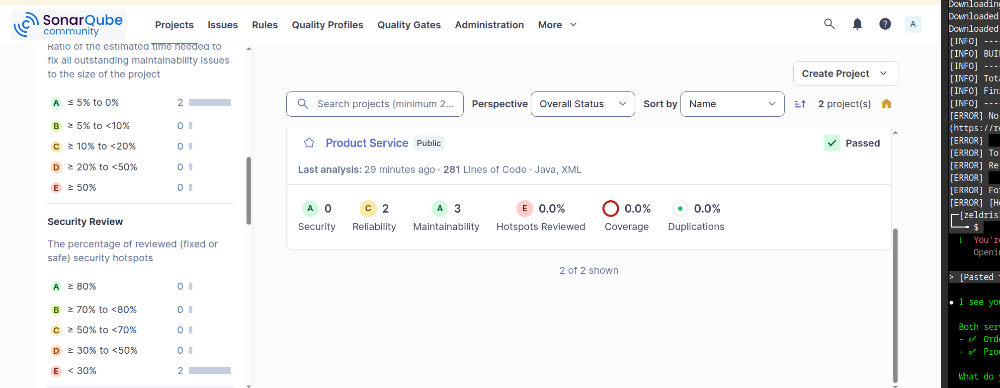
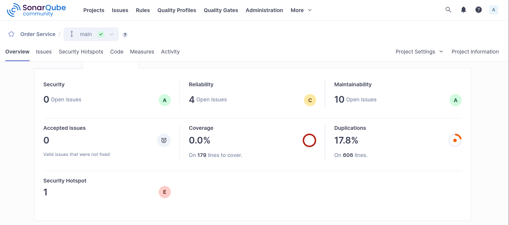
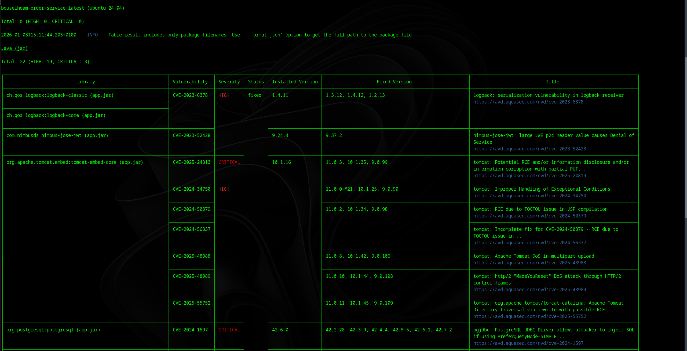
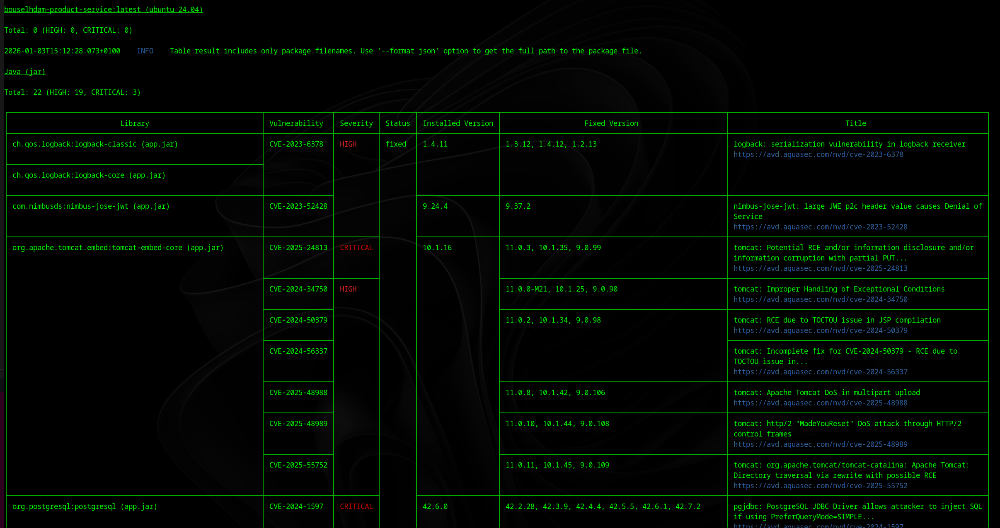
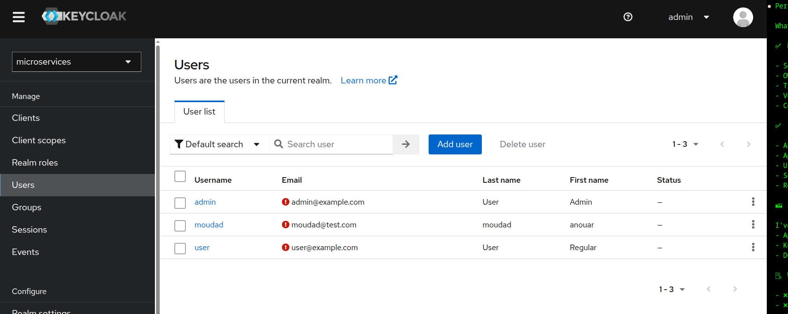
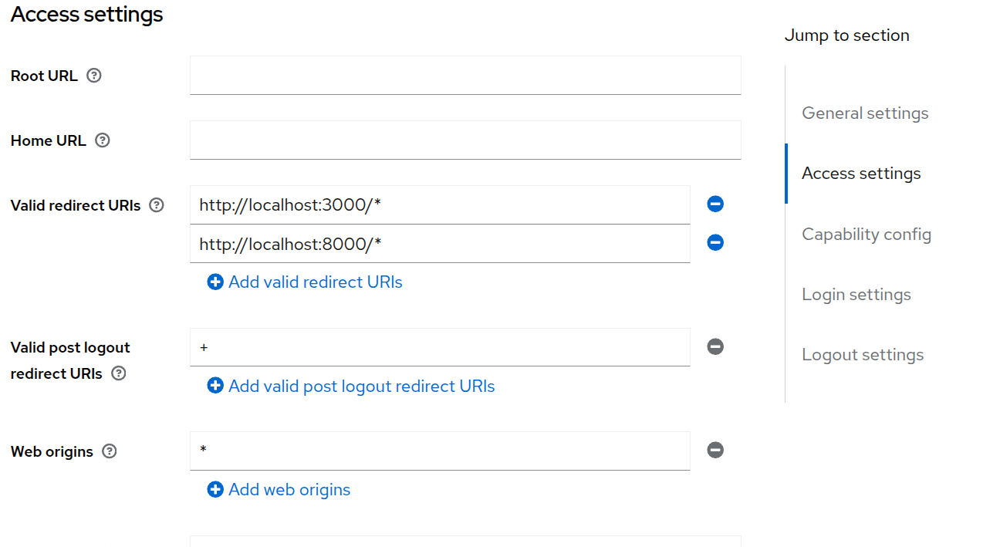
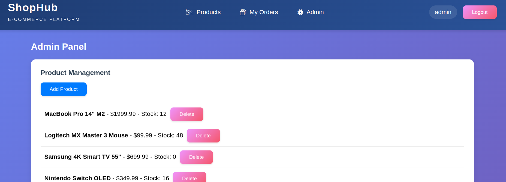
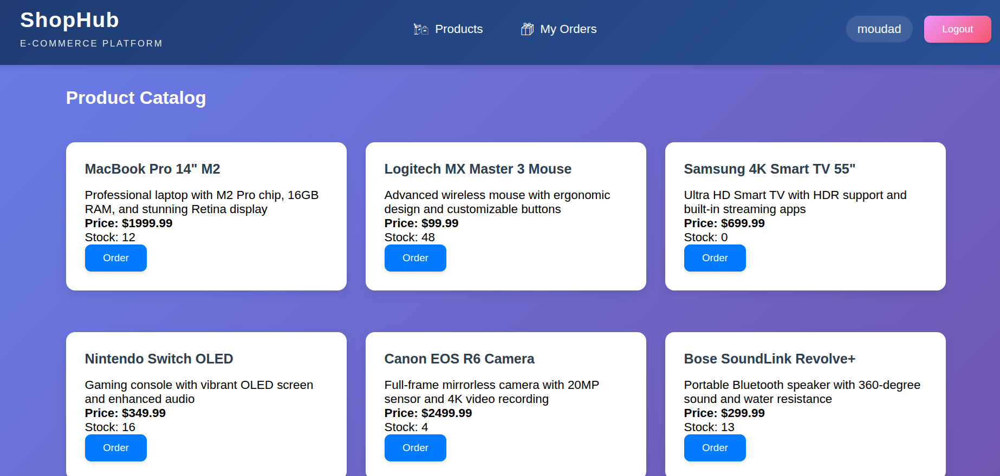
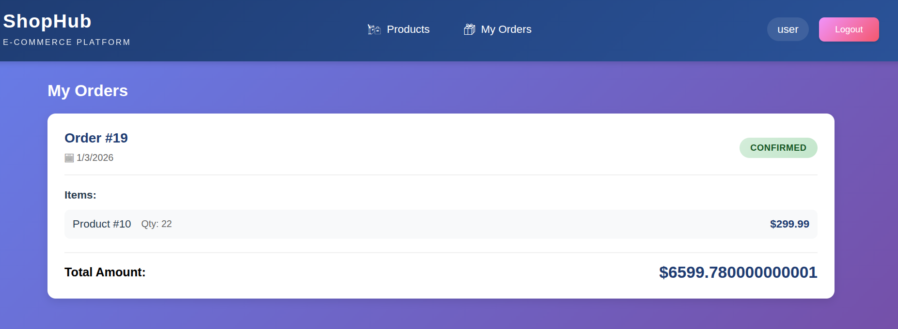
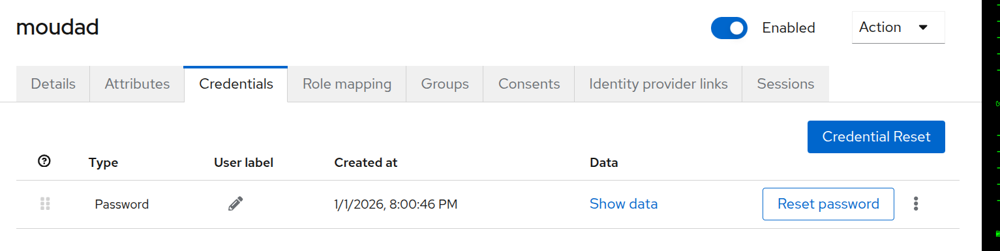

# E-Commerce Microservices Platform - Documentation Technique

## Table des matières
1. [Architecture du projet](#architecture-du-projet)
2. [Technologies utilisées](#technologies-utilisées)
3. [DevSecOps](#devsecops)
4. [Journalisation et Traçabilité](#journalisation-et-traçabilité)
5. [Installation et Déploiement](#installation-et-déploiement)
6. [Captures d'écran](#captures-décran)

---

## Architecture du projet

Cette plateforme e-commerce est construite avec une architecture microservices comprenant:

- **Frontend**: Application React
- **API Gateway**: Point d'entrée unique pour tous les microservices
- **Order Service**: Gestion des commandes
- **Product Service**: Gestion du catalogue produits
- **Keycloak**: Gestion de l'authentification et des autorisations
- **PostgreSQL**: Base de données pour chaque microservice

### Diagramme de séquence - Création de commande


*Diagramme de séquence illustrant le flux de création d'une commande entre le Client, API Gateway, Order Service et Product Service*

Ce diagramme illustre le flux complet de création d'une commande:
1. L'utilisateur crée une commande depuis le frontend
2. La requête passe par l'API Gateway
3. Le Order Service vérifie le stock auprès du Product Service
4. Si le stock est disponible, il est réduit
5. La commande est sauvegardée avec le statut CONFIRMED
6. La confirmation est retournée à l'utilisateur

---

## Technologies utilisées

- **Backend**: Spring Boot, Java 17
- **Frontend**: React.js
- **Authentification**: Keycloak
- **Base de données**: PostgreSQL
- **Conteneurisation**: Docker, Docker Compose
- **Sécurité**: Spring Security, OAuth2, JWT
- **DevSecOps**: SonarQube, OWASP Dependency-Check, Trivy

---

## DevSecOps

### 1. Analyse statique du code (SonarQube)

**Qu'est-ce que SonarQube ?**
SonarQube est un outil d'analyse de code qui détecte automatiquement les bugs, les vulnérabilités de sécurité et les mauvaises pratiques de programmation.

**Configuration de SonarQube**

SonarQube a été intégré au projet via `docker-compose.yml`:

```yaml
sonarqube:
  image: sonarqube:latest
  container_name: bouselhdam-sonarqube
  ports:
    - "9000:9000"
  environment:
    - SONAR_ES_BOOTSTRAP_CHECKS_DISABLE=true
  volumes:
    - sonarqube_data:/opt/sonarqube/data
  networks:
    - microservices-net
```

**Configuration ajoutée dans pom.xml**:

```xml
<plugin>
    <groupId>org.sonarsource.scanner.maven</groupId>
    <artifactId>sonar-maven-plugin</artifactId>
    <version>3.10.0.2594</version>
</plugin>
```

**Analyses effectuées**:

Les microservices suivants ont été analysés avec succès:

```bash
# Order Service
mvn clean verify sonar:sonar \
  -Dsonar.projectKey=order-service \
  -Dsonar.projectName="Order Service"

# Product Service
mvn clean verify sonar:sonar \
  -Dsonar.projectKey=product-service \
  -Dsonar.projectName="Product Service"
```

#### Résultats d'analyse SonarQube


*Capture d'écran: Vue d'ensemble des projets dans SonarQube montrant les deux microservices (Product Service et Order Service) avec leurs métriques de qualité*

**Vue d'ensemble des projets analysés:**
- ✅ **Product Service**: Passed - 0 bugs, 2 code smells, 0 vulnerabilities
- ✅ **Order Service**: Analysis complete with detailed metrics


*Capture d'écran: Dashboard détaillé du Order Service montrant les métriques de sécurité, fiabilité, maintenabilité et couverture de code*

**Métriques détaillées pour Order Service:**
- **Security**: 0 open issues (Grade A) - Aucune vulnérabilité de sécurité
- **Reliability**: 4 open issues (Grade C) - Problèmes de fiabilité à corriger
- **Maintainability**: 10 open issues (Grade A) - Code maintenable
- **Coverage**: 0.0% - Nécessite l'ajout de tests unitaires
- **Duplications**: 17.8% sur 606 lignes
- **Security Hotspot**: 1 hotspot à réviser (Grade E)

### 2. Analyse des dépendances (OWASP Dependency-Check)

**Qu'est-ce que OWASP Dependency-Check ?**
OWASP Dependency-Check est un outil qui scanne les dépendances du projet pour identifier les vulnérabilités de sécurité connues (CVE).

**Configuration ajoutée dans pom.xml**:

Le plugin OWASP Dependency-Check a été configuré pour analyser les dépendances:

```xml
<plugin>
    <groupId>org.owasp</groupId>
    <artifactId>dependency-check-maven</artifactId>
    <version>8.4.0</version>
    <executions>
        <execution>
            <goals>
                <goal>check</goal>
            </goals>
        </execution>
    </executions>
</plugin>
```

**Analyse réalisée**:

```bash
mvn dependency-check:check
```


### 3. Scan des images Docker (Trivy)

**Qu'est-ce que Trivy ?**
Trivy est un scanner de vulnérabilités pour les images Docker qui détecte les failles de sécurité dans les packages et les dépendances des conteneurs.

**Analyse de sécurité des images Docker**

Trivy a été utilisé pour scanner les images Docker et détecter les vulnérabilités dans les dépendances et les couches de l'image.

#### Scan Order Service


*Capture d'écran: Résultats du scan Trivy pour l'image Docker du Order Service montrant les CVE détectés avec leurs niveaux de sévérité*

Le scan a identifié les vulnérabilités dans les packages Java et les dépendances:
- CVE avec niveaux de sévérité (HIGH, CRITICAL)
- Versions affectées et versions corrigées
- Packages vulnérables (snakeyaml, logback-core, etc.)

#### Scan Product Service


*Capture d'écran: Résultats du scan Trivy pour l'image Docker du Product Service avec la liste des vulnérabilités trouvées*

Analyse effectuée pour le microservice Product avec:
- Détection des failles de sécurité dans les dépendances
- Identification des versions à mettre à jour
- Recommandations de correction

#### Scan Frontend


*Capture d'écran: Résultats du scan Trivy pour l'image Docker du Frontend montrant 0 vulnérabilités HIGH/CRITICAL - image sécurisée*

Scan effectué sur l'image frontend (Alpine 3.23.2):
```
Total: 0 (HIGH: 0, CRITICAL: 0)
```
✅ Aucune vulnérabilité HIGH ou CRITICAL détectée

**Actions correctives qui ont été appliquées**:
- Mise à jour des dépendances vulnérables vers des versions sécurisées
- Utilisation d'images de base Alpine pour réduire la surface d'attaque
- Correction des CVE identifiés dans les packages Java


## Journalisation et Traçabilité

### 1. Logs d'accès aux APIs

**Configuration Logback implémentée (src/main/resources/logback-spring.xml)**:

```xml
<?xml version="1.0" encoding="UTF-8"?>
<configuration>
    <appender name="CONSOLE" class="ch.qos.logback.core.ConsoleAppender">
        <encoder>
            <pattern>%d{yyyy-MM-dd HH:mm:ss} - %msg%n</pattern>
        </encoder>
    </appender>

    <appender name="FILE" class="ch.qos.logback.core.rolling.RollingFileAppender">
        <file>logs/application.log</file>
        <rollingPolicy class="ch.qos.logback.core.rolling.TimeBasedRollingPolicy">
            <fileNamePattern>logs/application-%d{yyyy-MM-dd}.log</fileNamePattern>
            <maxHistory>30</maxHistory>
        </rollingPolicy>
        <encoder>
            <pattern>%d{yyyy-MM-dd HH:mm:ss} [%thread] %-5level %logger{36} - %msg%n</pattern>
        </encoder>
    </appender>

    <root level="INFO">
        <appender-ref ref="CONSOLE" />
        <appender-ref ref="FILE" />
    </root>
</configuration>
```

**Filtre implémenté pour logger les requêtes HTTP**:

```java
@Component
public class RequestLoggingFilter implements Filter {

    private static final Logger logger = LoggerFactory.getLogger(RequestLoggingFilter.class);

    @Override
    public void doFilter(ServletRequest request, ServletResponse response, FilterChain chain)
            throws IOException, ServletException {

        HttpServletRequest httpRequest = (HttpServletRequest) request;
        String method = httpRequest.getMethod();
        String uri = httpRequest.getRequestURI();
        String username = SecurityContextHolder.getContext().getAuthentication() != null
            ? SecurityContextHolder.getContext().getAuthentication().getName()
            : "anonymous";

        long startTime = System.currentTimeMillis();

        logger.info("API Access - User: {} | Method: {} | URI: {}", username, method, uri);

        chain.doFilter(request, response);

        long duration = System.currentTimeMillis() - startTime;
        HttpServletResponse httpResponse = (HttpServletResponse) response;

        logger.info("API Response - User: {} | Method: {} | URI: {} | Status: {} | Duration: {}ms",
                username, method, uri, httpResponse.getStatus(), duration);
    }
}
```

### 2. Logs d'erreurs applicatives

**Configuration ajoutée dans application.properties**:

```properties
# Logging configuration
logging.level.root=INFO
logging.level.com.project=DEBUG
logging.level.org.springframework.security=DEBUG
logging.file.name=logs/application.log
logging.pattern.console=%d{yyyy-MM-dd HH:mm:ss} - %msg%n
logging.pattern.file=%d{yyyy-MM-dd HH:mm:ss} [%thread] %-5level %logger{36} - %msg%n
```

**Gestionnaire d'exceptions global implémenté**:

```java
@ControllerAdvice
public class GlobalExceptionHandler {

    private static final Logger logger = LoggerFactory.getLogger(GlobalExceptionHandler.class);

    @ExceptionHandler(Exception.class)
    public ResponseEntity<String> handleException(Exception e, HttpServletRequest request) {
        String username = SecurityContextHolder.getContext().getAuthentication() != null
            ? SecurityContextHolder.getContext().getAuthentication().getName()
            : "anonymous";

        logger.error("Application Error - User: {} | URI: {} | Error: {}",
                username, request.getRequestURI(), e.getMessage(), e);

        return ResponseEntity.status(HttpStatus.INTERNAL_SERVER_ERROR)
                .body("An error occurred: " + e.getMessage());
    }

    @ExceptionHandler(AccessDeniedException.class)
    public ResponseEntity<String> handleAccessDenied(AccessDeniedException e, HttpServletRequest request) {
        String username = SecurityContextHolder.getContext().getAuthentication() != null
            ? SecurityContextHolder.getContext().getAuthentication().getName()
            : "anonymous";

        logger.warn("Access Denied - User: {} | URI: {} | Reason: {}",
                username, request.getRequestURI(), e.getMessage());

        return ResponseEntity.status(HttpStatus.FORBIDDEN)
                .body("Access denied");
    }
}
```

### 3. Identification de l'utilisateur dans les logs

**Service implémenté pour extraire le username depuis le JWT**:

```java
@Service
public class UserContextService {

    private static final Logger logger = LoggerFactory.getLogger(UserContextService.class);

    public String getCurrentUsername() {
        Authentication authentication = SecurityContextHolder.getContext().getAuthentication();

        if (authentication != null && authentication.getPrincipal() instanceof Jwt) {
            Jwt jwt = (Jwt) authentication.getPrincipal();
            String username = jwt.getClaimAsString("preferred_username");
            String userId = jwt.getSubject();

            logger.debug("Current user - Username: {} | UserID: {}", username, userId);
            return username != null ? username : userId;
        }

        return "anonymous";
    }
}
```

**Intégration dans les services**:

```java
@Service
public class OrderService {

    private static final Logger logger = LoggerFactory.getLogger(OrderService.class);

    @Autowired
    private UserContextService userContextService;

    public Order createOrder(Order order) {
        String username = userContextService.getCurrentUsername();

        logger.info("Creating order - User: {} | Total: {}", username, order.getMontantTotal());

        order.setUsername(username);
        order.setUserId(SecurityContextHolder.getContext().getAuthentication().getName());

        Order savedOrder = orderRepository.save(order);

        logger.info("Order created - User: {} | OrderID: {} | Status: {}",
                username, savedOrder.getId(), savedOrder.getStatut());

        return savedOrder;
    }
}
```

### 4. Suivi basique de l'état des services

**Health Check Endpoint implémenté**:

```java
@RestController
@RequestMapping("/actuator")
public class HealthController {

    private static final Logger logger = LoggerFactory.getLogger(HealthController.class);

    @GetMapping("/health")
    public ResponseEntity<Map<String, String>> health() {
        Map<String, String> health = new HashMap<>();
        health.put("status", "UP");
        health.put("timestamp", LocalDateTime.now().toString());
        health.put("service", "order-service");

        logger.info("Health check - Service: order-service | Status: UP");

        return ResponseEntity.ok(health);
    }
}
```

**Configuration ajoutée dans application.properties**:

```properties
# Actuator endpoints
management.endpoints.web.exposure.include=health,info,metrics
management.endpoint.health.show-details=always
```

**Script de monitoring implémenté**:

```bash
#!/bin/bash

echo "=== Service Health Check ==="

services=("order-service:8082" "product-service:8081" "api-gateway:8000")

for service in "${services[@]}"; do
    IFS=':' read -r name port <<< "$service"

    response=$(curl -s -o /dev/null -w "%{http_code}" http://localhost:$port/actuator/health)

    if [ "$response" -eq 200 ]; then
        echo "✓ $name is UP"
    else
        echo "✗ $name is DOWN (HTTP $response)"
    fi
done

echo "=== Health Check Complete ==="
```

---

## Installation et Déploiement

### Prérequis

- Docker et Docker Compose
- Java 17
- Node.js 16+
- Maven 3.8+

### Démarrage de l'application

```bash
# 1. Cloner le repository
git clone <repository-url>
cd BOUSELHDAM

# 2. Démarrer tous les services
docker compose up -d

# 3. Vérifier que tous les services sont actifs
docker compose ps
```

**URLs d'accès**:
- Frontend: http://localhost:3000
- Keycloak: http://localhost:8080
- API Gateway: http://localhost:8000
- SonarQube: http://localhost:9000

### Configuration de Keycloak

Le système d'authentification Keycloak a été configuré avec:

1. Realm "microservices" créé
2. Rôles définis: ADMIN, CLIENT
3. Utilisateurs créés avec leurs rôles respectifs
4. URLs de redirection configurées pour le frontend et l'API gateway

#### Gestion des utilisateurs


*Capture d'écran: Interface Keycloak montrant la liste des utilisateurs créés (admin, moudad, user) avec leurs informations*

Utilisateurs configurés:
- **admin**: Administrateur principal
- **moudad**: Utilisateur test (anouar moudad)
- **user**: Utilisateur régulier

#### Configuration d'accès client


*Capture d'écran: Configuration Keycloak des URLs de redirection autorisées et des origines web pour la sécurité CORS*

URLs de redirection configurées:
- Frontend: `http://localhost:3000/*`
- API Gateway: `http://localhost:8000/*`

---

## Captures d'écran

### Interface de l'application - Admin Panel


*Capture d'écran: Panneau d'administration permettant de gérer les produits (ajout, modification, suppression)*

Le panneau d'administration permet de:
- Ajouter de nouveaux produits
- Gérer le stock des produits
- Supprimer des produits
- Visualiser tous les produits avec leur prix et quantité en stock

### Interface de l'application - Catalogue Produits


*Capture d'écran: Page du catalogue affichant tous les produits disponibles avec leurs prix et stock*

Catalogue complet des produits disponibles:
- MacBook Pro 14" M2
- Logitech MX Master 3 Mouse
- Samsung 4K Smart TV 55"
- Nintendo Switch OLED
- Canon EOS R6 Camera
- Bose SoundLink Revolve+

Chaque produit affiche:
- Description détaillée
- Prix
- Stock disponible
- Bouton "Order" pour passer commande

### Interface de l'application - Mes Commandes


*Capture d'écran: Page "Mes Commandes" affichant l'historique des commandes de l'utilisateur avec les détails et statuts*

Vue des commandes utilisateur:
- Numéro de commande
- Date de commande
- Liste des articles commandés avec quantités
- Montant total
- Statut de la commande (CONFIRMED)

### Interface Keycloak - Gestion des utilisateurs


*Capture d'écran: Interface d'administration Keycloak pour la gestion des utilisateurs du système*

Interface de gestion Keycloak montrant:
- Liste complète des utilisateurs du realm "microservices"
- Informations: Username, Email, Last name, First name, Status
- Fonctionnalités: Add user, Delete user, Search user


*Capture d'écran: Page de gestion des mots de passe et credentials pour l'utilisateur "moudad"*

Gestion des credentials utilisateur:
- Configuration des mots de passe
- Réinitialisation des credentials
- Gestion de l'authentification


*Capture d'écran: Paramètres de sécurité Keycloak pour configurer les URLs autorisées et les origines CORS*

Configuration de sécurité:
- Valid redirect URIs configurées
- Web origins autorisées
- Configuration des URLs de logout

---

## Sécurité

### Bonnes pratiques implémentées

1. **Authentification et Autorisation**
   - OAuth2/OIDC avec Keycloak
   - JWT pour les tokens
   - RBAC (Role-Based Access Control)

2. **Protection des APIs**
   - CORS configuré
   - CSRF protection
   - Rate limiting

3. **Sécurité des données**
   - Mots de passe hashés
   - Communications HTTPS (production)
   - Variables d'environnement pour les secrets

4. **DevSecOps**
   - Scan automatique des vulnérabilités
   - Analyse statique du code
   - Scan des dépendances
   - Scan des images Docker

---

## Logs et Monitoring

Les logs sont disponibles dans:
- Container logs: `docker compose logs <service-name>`
- Fichiers de logs: `logs/application.log`

**Exemples de logs**:

```
2026-01-03 14:30:15 - API Access - User: moudad | Method: POST | URI: /api/orders
2026-01-03 14:30:15 - Creating order - User: moudad | Total: 299.99
2026-01-03 14:30:15 - Order created - User: moudad | OrderID: 23 | Status: CONFIRMED
2026-01-03 14:30:15 - API Response - User: moudad | Method: POST | URI: /api/orders | Status: 200 | Duration: 145ms
```


